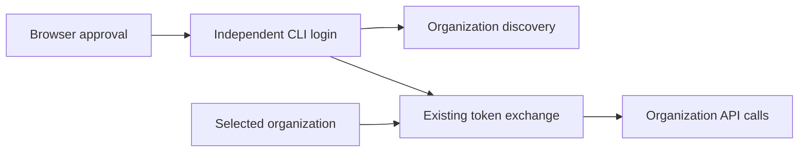

# Browser login integration and release gate

Browser approval creates an independent CLI login session. Organization API calls use the existing organization-token exchange.



## Source dependencies

| PR | Purpose |
| --- | --- |
| [Auth #328](***REMOVED-PRIVATE-REPO***) | Two tables and one nullable session column, including storage tests |
| [Auth #330](***REMOVED-PRIVATE-REPO***) | Device authorization and refresh grants on the existing token route; depends on #328 |
| [Frontend #2560](***REMOVED-PRIVATE-REPO***) | Explicit consent through the existing browser login and MFA flow |
| [CLI #1](https://github.com/voltagecloud/voltage-cli/pull/1) | Device login, credential storage, organization exchange, and API commands |

Auth #329 and #327 are absorbed into these two auth layers. Backend #2201's separate device-token validator is unnecessary.

The auth implementation lives on `codex/cli-oauth-device-flow`. Frontend uses `codex/cli-device-login`; CLI uses `codex/voltage-cli`.

## Authentication contract

Auth provides device start, request inspection, explicit decisions, and revocation under `/api/v1/oauth`. The single `/token` route accepts device, refresh, and organization-exchange grants.

One Rust allowlist enables the public client `voltage-cli`. Consent displays `voltage-api` and `voltage:account` as fixed metadata for full account login.

Device codes expire after ten minutes. Polling starts at five-second intervals and slows down after early requests. Redemption consumes authorization and creates a session atomically.

Device access tokens reuse current account claims, issuer, and signing keys. Each issuance receives a unique `jti`; there is no device-specific JWT validator.

The nullable `sessions.client_id` identifies device sessions. Legacy browser refresh excludes these sessions, and device sessions cannot approve other devices.

Refresh rotates opaque tokens without extending absolute session expiry. Replaying a consumed refresh token revokes its session family. Global signout includes device sessions.

Organization discovery uses the saved login token. Organization requests exchange that token at the saved account's auth endpoint with the selected organization as `audience`.

Exchange responses remain separate from saved login and refresh credentials. A failed exchange prevents the organization request. API-key authentication retains its existing behavior.

Current login claims still contain organization permissions during the additive exchange rollout. CLI organization selection does not restrict the account's underlying permissions.

The frontend requires explicit approval and binds the decision to the displayed authorization and account. Account changes require renewed review. Rejected browser credentials trigger login; service outages preserve credentials.

## Configuration

Set auth's `VOLTAGE_CLI_VERIFICATION_URI` to the frontend's `/cli/authorize` URL. HTTPS is required except for loopback development.

Helm exposes `cliOAuth.verificationUri`. Existing ingress routing and IP limits cover OAuth endpoints. Device polling intervals remain in PostgreSQL; consent requests have no additional account limiter.

Periodic bounded cleanup removes expired device authorization rows and device sessions. No special OAuth ingress or database client registry is required.

The frontend uses its existing `PUBLIC_AUTH_URL` or server `PROXY_TARGET_AUTH_URL`. Session expiry uses auth's existing refresh lifetime configuration.

## Local verification

Auth checks include formatting, clippy across all targets/features, and the full Rust/PostgreSQL suite. Tests cover real signing and all three grants through one HTTP route.

Frontend checks use `node packages/e2e/scripts/test-cli-authorization.mjs`. This dedicated runner starts isolated loopback services with fake credentials and clears live-account variables.

Install its browser with `yarn workspace @repo/e2e exec playwright install chromium`. Run `yarn run check` for frontend code or build changes.

Run these CLI checks:

```sh
cargo fmt --check
cargo clippy --locked --all-targets -- -D warnings
cargo test --locked
python3 scripts/check-coverage.py
```

See [verification](verification.md) for current results and [local services](local-demo.md) for an independently configured browser demo.

## Staging acceptance

1. Deploy both auth layers and confirm browser login, refresh, and organization exchange still work.
2. Deploy the frontend approval page using its documented release procedure.
3. Verify the auth verification URL points to that frontend.
4. Complete CLI approval with an existing browser session, fresh login, and MFA.
5. Verify denial, expiry, polling slowdown, single redemption, and independent sessions on two devices.
6. Verify organization discovery, organization switching, exchanged API access, and permission rejection.
7. Verify concurrent local processes, refresh rotation, replay detection, logout, and global signout.
8. Check native credential storage on supported operating systems and explicit file storage on headless Linux.
9. Verify deployed ingress limits and code/token redaction.
10. Record deployed revisions and acceptance results in `docs/verification.md` before publishing the CLI.

Payment acceptance requires an explicitly selected test-network wallet. Existing payment and checkout tests remain separate from device-login validation.

Local tests do not establish deployed acceptance. The release workflow requires staging verification and creates a draft release for review.
